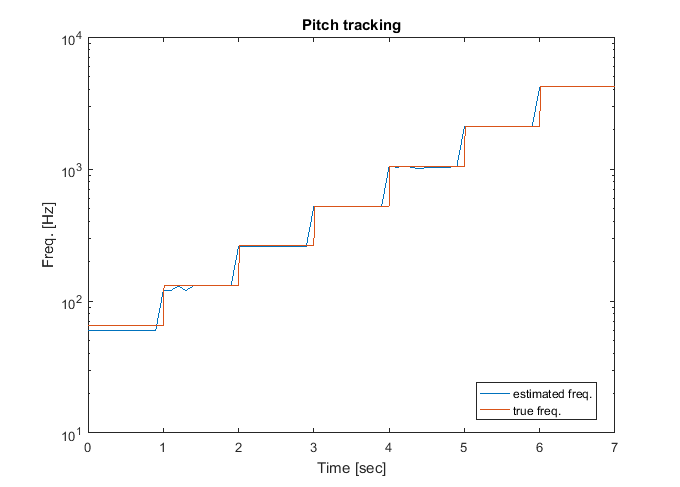

# HEPPIE_pitch_estimation_algorithm
HEPPIE, a simple and practical pith estimation algorithm

## WHAT IS IT?
It is an algorithm to estimate the fundamental frequency of sound signals, which requires a minimum of parameters and is characterized by operating in a wide audible spectrum, ranging from 50 Hz to 5 kHz, with an accuracy and execution times adjustable according to the required resolution. 

## HOW IT WORKS

The algorithm HEPPIE (for "HElpful and Practical PItch Estimation") operates primarily in the frequency domain, specifically based on the computation of the periodogram, by means of the FFT, and a differential filter processing followed by a matched filter, in order to detect the significant spectral peaks and the distance between them.

## HOW TO USE IT

### Demo code:

 Execute the Matlab code test_demo.m.

## THINGS TO NOTICE

This program is distributed in the hope that it will be useful,
but WITHOUT ANY WARRANTY; without even the implied warranty of
MERCHANTABILITY or FITNESS FOR A PARTICULAR PURPOSE.

## IMPROVE THE CODE

Fork the code to improve it.

## PUBLISHED

The published work that complements the code of this repository is the following: 

-Laguna-Sanchez, G.A. et al (2024). Simple and practical algorithm for wide spectrum pitch estimation with an acceptable compromise between accuracy and computational cost. In Proceedings of IV Conferencia Internacional en Comunicación y Tecnologías Aplicadas (ICOMTA'24). Lima, Perú.

This paper outlines, in more detail, the related work and formal background of this proposal.

## RELATED CODE
- See the references of the work to be published.

## HOW TO CITE

If you mention this model in a publication, I ask that you include these citations for the model:

* Laguna-Sanchez, G.A. (2024).  HEPPIE, a simple and practical pith estimation algorithm.  https://github.com/galaguna/HEPPIE_pitch_estimation_algorithm. 

## COPYRIGHT AND LICENSE

Copyright 2024 Gerardo Abel Laguna-Sanchez.

This program is free software: you can redistribute it and/or modify it under the terms of the GNU General Public License as published by the Free Software Foundation, either version 3 of the License, or(at your option) any later version. See <http://www.gnu.org/licenses/>
